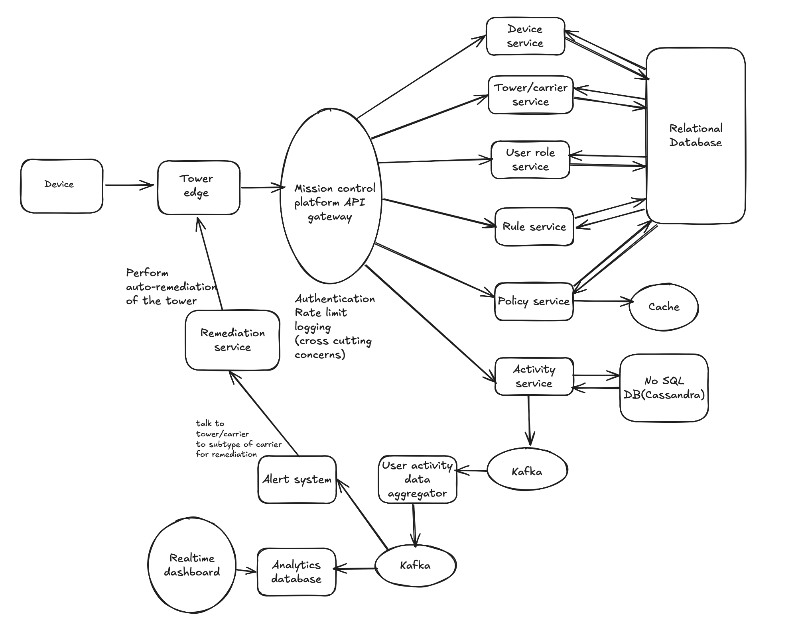

# Telecom Mission Control SaaS – Backend System Design

## Problem Statement

A telecom mission control SaaS platform provides intelligent services for enterprises. Multiple carriers often share
cell towers, but not all towers support all carriers. The carriers (AT&T, Verizon, T-Mobile, etc.) determine the devices
supported at the towers and the device's operating system (iOS, Android, Windows, etc.). For example, some towers will
only allow iOS-based AT&T devices, while others will allow Android and Windows-based AT&T and T-Mobile devices, as well
as additional unique combinations. The equipment at the cell tower detects the apps used by the user on their device and
captures the actions performed on the app by the user. The system captures the policy determined by the enterprise to
enforce the rule, allowing or denying the list of actions permitted on the app based on the user's role. The system
provides value-added services such as a real-time dashboard to monitor the security health. A higher subscription plan
provides auto-remedial action enforced at the cell towers through enterprise-defined policies to secure the edge. The
system integrates with various communications real estate developers to ingest (register) the information related to the
towers present nationwide and the carriers they serve. The system allows connecting to different sources for onboarding
existing users and their devices. Additionally, the system enables auto-discovery of new enterprise devices through the
cell towers.

Architect a high-assurance, scalable BACKEND system. Model entities and their relationships at various layers. Design a
performant API to fulfill the system functionality. No coding is required to implement logic and functionality at any
layer. You can make your assumptions for the choice of technology and the generic software that you'd apply. You may
also use specific software if you prefer.

## Assignment Instructions

- Submit as a GitHub repository link.
- Duration: 3 days
- Due Date: Jun 10, 2025, 9 PM Pacific Time
- Scope: Backend system architecture, API design, entity modeling. No code implementation required.

---
## 1. Requirements
## Functional Requirements

### Primary

- Saas platform supporting multiple carriers.
- Provides an ability to track users and actions performed by the users.
- Supports add/modify rules and assigning rules to the specific roles.
- Supports creating roles and assigning roles to the users.
- Restricting user action based on a policy (rules, roles, actions)
- Provide real time dashboard to monitor the system for threats.

### Secondary

- Ability to auto-discovery of the devices
- Support for registering a cell tower with carriers.
- Ability to provide auto-remedial action as the cell based on carrier subscription plan on order to secure the edge

---

## Nonfunctional Requirements

| Property          | Description                                                                |
|-------------------|----------------------------------------------------------------------------|
| **Reliability(high assurance)**   | System should gracefully handle failures via redundancy and replication.   |
| **Scalability**   | We will assume number of daily active users using the system is 50M users. |
| **Security**      | Support Secure auth, HTTPS, rate-limiting.                                 |
| **Extensibility** | Microservices architecture, with version based api                         |
| **Low Latency**   | Goal: ≤ 100ms latency via local policy evaluation at the client.           |
| **Consistency**   | Strong consistency for config writes; eventual consistency for client sync. |

---

## 2. Core Entities

- `User`
- `Device`
- `Carrier`
- `Tower`
- `Role`
- `Rule`
- `ActivityEvent`

---

## Data Storage Strategy

| Data Type               | Storage Type                                                     | Notes                                     |
|-------------------------|------------------------------------------------------------------|-------------------------------------------|
| User, Role, Rule, Tower | Relational DB                                                    | For transactional integrity               |
| Activity Events         | Cassandra (NoSQL)                                                | High-throughput, write-heavy, append-only |
| Policy Cache            | In-memory (Redis)                                                | Fast edge lookups                         |
| Sharding                | By `user_id` for users; `(user_id, carrier_id, date)` for events |

---

## 3. Data Flow Diagram
### Policy file downloaded to the client


---

## 4. Data Model


---

## 5. REST API

### API Documentation

---

### Users

#### Register a User

- **Method:** `POST`
- **URL:** `https://{host}/v1/users`
- **Authentication:** Yes/No
- **Headers:**
    - `Content-Type: application/json`
    - `Authorization: Bearer TOKEN`
    - `X-Carrier-Id: carrier_id`

**Request Body:**
```json
{
  "device_hash": "string",
  "eid": "string",
  "os_type": "string"
}
```

**Response (201 Created):**
```json
{
  "message": "User registered successfully",
  "user_id": "uuid-string"
}
```

---

#### Assign Users to a Role

- **Method:** `POST`
- **URL:** `https://{host}/v1/roles/{roleId}/users`
- **Authentication:** Yes/No
- **Headers:**
    - `Authorization: Bearer TOKEN`
    - `Content-Type: application/json`

**Request Body:**
```json
{
  "userIds": ["string"]
}
```

**Response:**
```json
{
  "message": "User(s) is/are successfully assigned to role"
}
```

---

### Roles

#### Add a Role

- **Method:** `POST`
- **URL:** `https://{host}/v1/roles`
- **Authentication:** Yes/No
- **Headers:**
    - `Authorization: Bearer TOKEN`
    - `Content-Type: application/json`

**Request Body:**
```json
{
  "name": "admin/user",
  "description": "string"
}
```

**Response:**
```json
{
  "message": "Role is successfully created"
}
```

---

### Rules

#### Add a Rule

- **Method:** `POST`
- **URL:** `https://{host}/v1/rules`
- **Authentication:** Yes/No
- **Headers:**
    - `Authorization: Bearer TOKEN`
    - `Content-Type: application/json`

**Request Body:**
```json
{
  "name": "string",
  "description": "string",
  "condition": {
    "field": "appId",
    "operator": "EQUALS" | "NOT_EQUALS" | "CONTAINS",
    "value": "string"
  },
  "action": "BLOCK" | "ALLOW" | "ALERT"
}
```

**Response:**
```json
{
  "message": "Rule is added successfully"
}
```

---

### Policy

#### Add Rule to Role (with Carriers)

- **Method:** `POST`
- **URL:** `https://{host}/v1/role-rules`
- **Authentication:** Yes/No
- **Headers:**
    - `Authorization: Bearer TOKEN`
    - `Content-Type: application/json`

**Request Body:**
```json
{
  "roleId": "string",
  "ruleId": "string",
  "carrierIds": ["string"]
}
```

---

#### Update Carrier IDs in Role-Rule

- **Method:** `PATCH`
- **URL:** `https://{host}/v1/role-rules/{id}/carriers`
- **Authentication:** Yes/No
- **Headers:**
    - `Authorization: Bearer TOKEN`
    - `Content-Type: application/json`

**Request Body:**
```json
{
  "op": "add" | "remove" | "replace",
  "value": ["carrier_id1", "carrier_id2"]
}
```
**Response:**
201 created

---

### Towers

#### Register a Tower

- **Method:** `POST`
- **URL:** `https://{host}/v1/towers`
- **Authentication:** Yes/No

**Request Body:**
```json
{
  "name": "string",
  "longitude": "double",
  "latitude": "double"
}
```

**Response:**
```json
{
  "message": "Tower registered successfully"
}
```

---

#### Associate Tower with a Carrier

- **Method:** `POST`
- **URL:** `https://{host}/v1/towers/{id}/carriers`
- **Authentication:** Yes/No

**Request Body:**
```json
{
  "carrierId": "string"
}
```

**Response:**
```json
{
  "message": "Tower is associated with carrier successfully"
}
```

---

### Carriers

#### Register a Carrier

- **Method:** `POST`
- **URL:** `https://{host}/v1/carriers`
- **Authentication:** Yes/No

**Request Body:**
```json
{
  "name": "string",
  "subType": "basic" | "prime"
}
```

**Response:**
```json
{
  "message": "Carrier registered successfully"
}
```

---

### Activity

#### Log an Activity Event

_Endpoint and schema to be defined based on event format and ingestion design._

TODO
---
---


## 6. High Level Design


---

## 🔍 Deep Dive: Non-Functional Requirements

---

### Reliability (High Assurance)

- Data is replicated across multiple database instances to ensure failover and availability.
- Services are deployed in multiple instances, ensuring high availability even if one instance fails.
- GET APIs can be safely retried.
- For POST and PATCH APIs, idempotency is enforced via an optional `idempotent-key` header. 
- Duplicate requests with the same key are ignored if already processed.

---

### Scalability

#### Compute Layer

- As we have designed the services as microservices, they are stateless, 
they can be easily autoscaled as we see more traffic.

#### Storage Layer

- **Hybrid persistence approach**:
    - **Relational DB**: Used for entities with relationships and transactional needs 
  (e.g., Device, Tower, Carrier, User, Role-Rule, Policy).
    - **NoSQL (Cassandra)**: Used for high-throughput, append-only workloads like `activity_events` 
  (partitioned by `user_id` and `carrier_id`).
  

- **Entity strategies**:
    - Policy service → Low write, read heavy, read from cache.
    - Role → Low volume of data, can be used in in memory cache.
    - User → As we have mentioned 10M daily users, therefore we will need to shard the 
  data across multiple servers, and we will use user_id as partition key.
    - Activity Events → write heavy load, append only database with low latency 
  and high resiliency.

#### Cache Layer

- As policy service is ready heavy, we can store the policy in the cache for low latency.

---

### Security

- Authentication is provided at the gateway level.
- Rate limit is implemented at the gateway level to avoid abuse.
- All the communication is done with securely i.e. https protocol.
- Auth tokens are checked for expiration and are refreshed frequently.

---

### Extensibility

- Microservices can be independently deployed and scaled — no inter-service coupling.
- API versioning supports backward compatibility and future enhancements.
- JSON-based rule definitions allow for easy rule extension.
- Role/Rule objects support `is_active` flag for soft deactivation.

---

### Low Latency

- Policy file is downloaded and cached on the client-side upon initial connection.
- Policies are evaluated on-device for instant response.
- Server tracks and pushes updates via background monitoring if policy version changes.

---

### Consistency

#### Strong Consistency:

- All the different systems will see the same data. 
That means, all the data is written successfully before returning success 
in the API.
  - role
  - rule
  - associating rule with role(policy)

#### Eventual Consistency:

- As there is policy updated in the backend, it will be eventually downloaded 
to the client.
- updating the policy files to the user devices.

---
